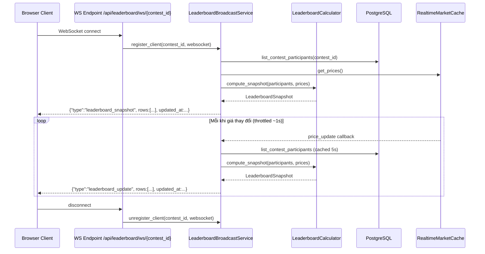
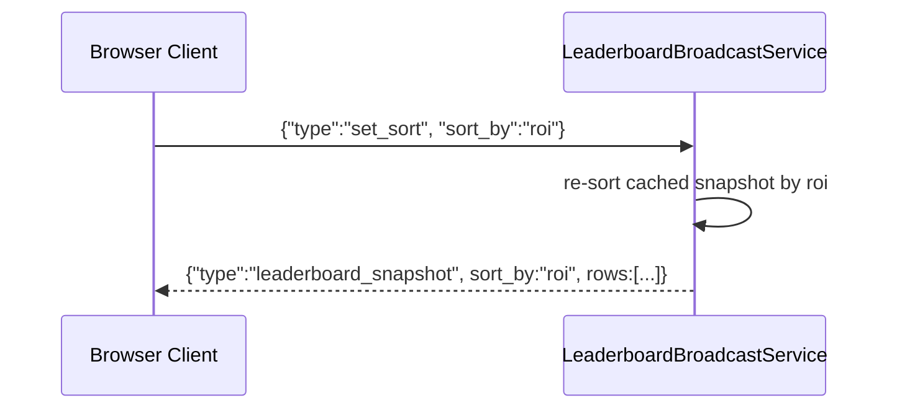

# Design Document: Leaderboard Realtime

## Overview

Feature này xây dựng hệ thống leaderboard thời gian thực cho các crypto DEX trading contest. Mỗi khi giá Binance thay đổi (qua WebSocket feed sẵn có), server tính lại equity/PnL/ROI của tất cả participants trong contest đang active và đẩy bảng xếp hạng cập nhật xuống tất cả client đang theo dõi — không cần poll. Admin và User đều xem được, Admin có thêm thông tin chi tiết (user_id, participant status).

Hiện tại hệ thống đã có `GET /api/crypto/contests/{id}/leaderboard` nhưng chỉ là REST snapshot dùng `get_latest_prices()` (gọi Binance REST), không realtime, không push. Feature này nâng cấp lên WebSocket push với giá từ `RealtimeMarketCache` đang có sẵn trong `app.state.crypto_realtime`.

---

## Architecture

```mermaid
graph TD
    A[Binance WebSocket Feed] -->|miniTicker price events| B[BinanceRealtimeService]
    B -->|update_price| C[RealtimeMarketCache]
    B -->|price_changed event| D[LeaderboardBroadcastService]
    D -->|read prices| C
    D -->|query participants + positions| E[(PostgreSQL via SQLAlchemy)]
    D -->|compute equity/PnL/ROI| F[LeaderboardCalculator]
    F -->|sorted LeaderboardSnapshot| D
    D -->|broadcast JSON| G[WebSocket clients]

    H[User/Admin Browser] -->|WS connect /api/leaderboard/ws/{contest_id}| D
    I[REST GET /api/leaderboard/{contest_id}] -->|HTTP snapshot| F
```

---

## Sequence Diagrams

### Client kết nối và nhận leaderboard realtime



### Thay đổi sort criterion từ client




---

## Components and Interfaces

### Component 1: LeaderboardCalculator

**Purpose**: Tính equity, PnL, ROI, volume cho từng participant dựa trên giá realtime. Pure function, không có side effect.

**Interface**:
```python
@dataclass(frozen=True)
class LeaderboardRow:
    rank: int
    user_id: int          # ẩn với user thường, hiển thị với admin
    user: str             # display name
    equity: float         # cash + sum(position * current_price)
    pnl: float            # equity - initial_equity
    roi: float            # pnl / initial_equity * 100 (%)
    volume: float         # sum executed_notional of filled orders
    trade_count: int
    last_trade: str | None
    participant_status: str  # active | locked | disqualified

@dataclass(frozen=True)
class LeaderboardSnapshot:
    contest_id: str
    sort_by: Literal["equity", "pnl", "roi"]
    rows: list[LeaderboardRow]
    updated_at: datetime

class LeaderboardCalculator:
    def compute_snapshot(
        self,
        contest: Contest,
        participants: list[ContestParticipant],
        prices: dict[str, float],
        sort_by: Literal["equity", "pnl", "roi"] = "equity",
    ) -> LeaderboardSnapshot: ...

    def compute_single_row(
        self,
        contest: Contest,
        participant: ContestParticipant,
        prices: dict[str, float],
    ) -> LeaderboardRow: ...
```

**Responsibilities**:
- Tính equity = cash_balance + sum(qty * price) cho mỗi participant
- Tính PnL = equity - initial_equity
- Tính ROI = (PnL / initial_equity) * 100
- Tính volume = sum của executed_notional tất cả filled orders
- Sort rows theo tiêu chí được yêu cầu (equity, pnl, hoặc roi)
- Gán rank theo thứ tự sau sort
- Xử lý trường hợp initial_equity = 0 (ROI = 0)
- Bỏ qua participant không có account

---

### Component 2: LeaderboardBroadcastService

**Purpose**: Quản lý WebSocket clients, nhận price update từ `BinanceRealtimeService`, tính toán và broadcast leaderboard.

**Interface**:
```python
class LeaderboardBroadcastService:
    def __init__(
        self,
        realtime_service: BinanceRealtimeService,
        db_session_factory: Callable[[], Session],
        calculator: LeaderboardCalculator,
        throttle_seconds: float = 1.0,
        participant_cache_ttl: float = 5.0,
    ): ...

    async def start(self) -> None:
        """Đăng ký price callback với BinanceRealtimeService, start broadcast loop."""

    async def stop(self) -> None:
        """Dừng broadcast loop, đóng tất cả WebSocket connections."""

    async def handle_client(
        self,
        websocket: WebSocket,
        contest_id: str,
        is_admin: bool = False,
    ) -> None:
        """Accept WebSocket, gửi snapshot ngay, duy trì kết nối."""

    async def on_price_update(self, prices: dict[str, float]) -> None:
        """Callback gọi bởi BinanceRealtimeService khi có price tick mới."""
```

**Responsibilities**:
- Theo dõi connected clients theo contest_id
- Throttle broadcast: không gửi quá 1 lần/giây cho mỗi contest
- Cache danh sách participants (TTL 5s) để tránh query DB liên tục
- Khi client gửi `{"type":"set_sort","sort_by":"..."}`, re-sort và gửi lại
- Ẩn `user_id` trong response khi `is_admin=False`
- Graceful disconnect khi client ngắt kết nối


---

### Component 3: LeaderboardRouter (FastAPI)

**Purpose**: Expose REST endpoint cho snapshot và WebSocket endpoint cho realtime feed.

**Interface**:
```python
# REST - snapshot không auth (giống endpoint hiện tại nhưng dùng realtime price)
GET /api/leaderboard/{contest_id}
    ?sort_by=equity|pnl|roi  (default: equity)
    Response: LeaderboardSnapshotResponse

# WebSocket - realtime push (không auth, filter user_id ở server)
WS  /api/leaderboard/ws/{contest_id}
    ?sort_by=equity|pnl|roi  (default: equity)
    Client → Server: {"type":"set_sort","sort_by":"roi"}
    Server → Client: {"type":"leaderboard_snapshot"|"leaderboard_update", "rows":[...], ...}

# WebSocket Admin - realtime với user_id (yêu cầu admin token qua query param)
WS  /api/leaderboard/ws/{contest_id}?admin_token={jwt}
    Server → Client: rows có thêm user_id, participant_status
```

---

## Data Models

### LeaderboardSnapshotResponse (API response)

```python
class LeaderboardRowPublic(BaseModel):
    rank: int
    user: str
    equity: float
    pnl: float
    roi: float        # percentage, e.g. 12.5 = +12.5%
    volume: float
    trade_count: int
    last_trade: str | None

class LeaderboardRowAdmin(LeaderboardRowPublic):
    user_id: int
    participant_status: str   # active | locked | disqualified

class LeaderboardSnapshotResponse(BaseModel):
    contest_id: str
    sort_by: str
    updated_at: str           # ISO8601 UTC
    rows: list[LeaderboardRowPublic]
```

### WebSocket message types

```python
# Server → Client (initial và mỗi update)
{
    "type": "leaderboard_snapshot" | "leaderboard_update",
    "contest_id": str,
    "sort_by": "equity" | "pnl" | "roi",
    "updated_at": "2024-01-01T12:00:00Z",
    "rows": [
        {
            "rank": 1,
            "user": "Alice",
            "equity": 11250.50,
            "pnl": 1250.50,
            "roi": 12.505,
            "volume": 45000.00,
            "trade_count": 8,
            "last_trade": "BTCUSDT buy"
        }
    ]
}

# Client → Server (đổi sort)
{"type": "set_sort", "sort_by": "roi"}

# Server → Client (error)
{"type": "error", "message": "Contest not found"}
```

---

## Algorithmic Pseudocode

### Tính equity và ranking

```pascal
ALGORITHM compute_snapshot(contest, participants, prices, sort_by)
INPUT:
  contest: Contest object với initial_balance, quote_asset
  participants: list[ContestParticipant] với account, positions, balances
  prices: dict[symbol -> current_price]
  sort_by: "equity" | "pnl" | "roi"
OUTPUT: LeaderboardSnapshot

BEGIN
  rows ← []

  FOR each participant IN participants DO
    account ← participant.account
    IF account IS NULL THEN
      CONTINUE
    END IF

    -- Tính cash (USDT_TEST balance)
    cash ← sum(balance.available FOR balance IN account.balances
               WHERE balance.asset == contest.quote_asset)

    -- Tính giá trị positions theo giá realtime
    position_value ← 0
    FOR each position IN account.positions DO
      current_price ← prices.get(position.asset.symbol, 0)
      position_value ← position_value + position.quantity * current_price
    END FOR

    equity ← cash + position_value
    initial ← account.initial_equity
    pnl ← equity - initial
    roi ← (pnl / initial * 100) IF initial > 0 ELSE 0

    -- Tính volume từ filled orders
    filled_orders ← [o FOR o IN account.orders WHERE o.status == "filled"]
    volume ← sum(o.executed_notional FOR o IN filled_orders)

    last_order ← max(account.orders BY submitted_at, default=NULL)
    last_trade ← (last_order.asset.symbol + " " + last_order.side)
                  IF last_order IS NOT NULL ELSE NULL

    rows.append(LeaderboardRow(
      rank=0,
      user_id=participant.user_id,
      user=display_name(participant.user_id),
      equity=round(equity, 2),
      pnl=round(pnl, 2),
      roi=round(roi, 4),
      volume=round(volume, 2),
      trade_count=len(filled_orders),
      last_trade=last_trade,
      participant_status=participant.status,
    ))
  END FOR

  -- Sort theo tiêu chí
  sort_key ← GET_SORT_KEY(sort_by)
  rows.sort(key=sort_key, reverse=True)

  -- Gán rank
  FOR i, row IN enumerate(rows, start=1) DO
    row.rank ← i
  END FOR

  RETURN LeaderboardSnapshot(
    contest_id=contest.slug,
    sort_by=sort_by,
    rows=rows,
    updated_at=now_utc(),
  )
END
```


### Throttle broadcast loop

```pascal
ALGORITHM broadcast_loop(contest_id, clients, calculator, participant_cache)
INPUT: contest_id, clients: set[WebSocket], throttle=1.0s, cache_ttl=5.0s
OUTPUT: side-effect: sends messages to clients

BEGIN
  last_broadcast_at ← 0
  cached_participants ← NULL
  cached_at ← 0

  LOOP WHILE service_is_running DO
    WAIT FOR price_update_signal OR throttle_timeout

    now ← time()
    IF now - last_broadcast_at < throttle THEN
      CONTINUE  -- skip, too soon
    END IF

    -- Refresh participant cache nếu hết TTL
    IF cached_participants IS NULL OR now - cached_at > cache_ttl THEN
      cached_participants ← db.list_contest_participants(contest_id)
      cached_at ← now
    END IF

    prices ← realtime_cache.get_prices()
    IF prices IS EMPTY THEN
      CONTINUE
    END IF

    snapshot ← calculator.compute_snapshot(contest, cached_participants, prices)
    message ← serialize_to_json(snapshot, type="leaderboard_update")

    FOR each client IN clients DO
      TRY
        AWAIT client.send_json(message)
      EXCEPT WebSocketDisconnect
        clients.remove(client)
      END TRY
    END FOR

    last_broadcast_at ← now
  END LOOP
END
```

### Handle client WebSocket connection

```pascal
ALGORITHM handle_client(websocket, contest_id, is_admin)
INPUT: websocket, contest_id: str, is_admin: bool
OUTPUT: side-effect: manages WebSocket lifecycle

BEGIN
  contest ← db.get_contest_by_slug(contest_id)
  IF contest IS NULL THEN
    AWAIT websocket.accept()
    AWAIT websocket.send_json({"type": "error", "message": "Contest not found"})
    AWAIT websocket.close()
    RETURN
  END IF

  AWAIT websocket.accept()
  clients[contest_id].add(websocket)

  TRY
    -- Gửi snapshot ngay khi connect
    participants ← db.list_contest_participants(contest_id)
    prices ← realtime_cache.get_prices()
    snapshot ← calculator.compute_snapshot(contest, participants, prices)
    response ← serialize_snapshot(snapshot, is_admin=is_admin)
    AWAIT websocket.send_json({**response, "type": "leaderboard_snapshot"})

    -- Lắng nghe message từ client
    LOOP WHILE connected DO
      message ← AWAIT websocket.receive_json()
      IF message.type == "set_sort" THEN
        sort_by ← VALIDATE sort_by IN {"equity", "pnl", "roi"}
        re_sorted ← re_sort(snapshot, sort_by)
        AWAIT websocket.send_json({**re_sorted, "type": "leaderboard_snapshot"})
      END IF
    END LOOP

  EXCEPT WebSocketDisconnect
    -- normal disconnect
  FINALLY
    clients[contest_id].discard(websocket)
  END TRY
END
```

---

## Key Functions with Formal Specifications

### LeaderboardCalculator.compute_snapshot()

**Preconditions:**
- `participants` là list có thể rỗng
- `prices` là dict, có thể thiếu một số symbols (fallback về 0)
- `sort_by` phải là một trong `{"equity", "pnl", "roi"}`
- `contest.initial_balance > 0`

**Postconditions:**
- `len(snapshot.rows) == len([p for p in participants if p.account is not None])`
- `snapshot.rows` được sort giảm dần theo `sort_by`
- `snapshot.rows[i].rank == i + 1` với mọi i
- `row.equity == row.pnl + contest.initial_balance` (vì pnl = equity - initial)
- `row.roi == 0` khi `initial_equity == 0`
- Tất cả giá trị số được round đúng precision

**Loop Invariants (vòng lặp tính rows):**
- Sau mỗi iteration, `len(rows)` tăng đúng 1 nếu participant có account
- `position_value >= 0` luôn đúng (quantity >= 0, price >= 0)

---

### LeaderboardBroadcastService.on_price_update()

**Preconditions:**
- `prices` là dict không rỗng
- Service đã được start

**Postconditions:**
- Nếu có clients đang kết nối với bất kỳ contest nào có symbols trong `prices`, broadcast được schedule
- Broadcast thực sự xảy ra không sớm hơn `throttle_seconds` kể từ lần broadcast trước


---

## Example Usage

### Backend: Khởi động service trong lifespan

```python
# src/jobs.py - thêm vào build_lifespan
from src.services.leaderboard_broadcast import LeaderboardBroadcastService

@asynccontextmanager
async def lifespan(app: Any):
    init_db()
    realtime = realtime_factory()
    leaderboard = LeaderboardBroadcastService(
        realtime_service=realtime,
        db_session_factory=SessionLocal,
    )
    app.state.crypto_realtime = realtime
    app.state.leaderboard_broadcast = leaderboard
    await realtime.start()
    await leaderboard.start()
    try:
        yield
    finally:
        await leaderboard.stop()
        await realtime.stop()
```

### Backend: REST endpoint snapshot

```python
# GET /api/leaderboard/{contest_id}?sort_by=equity
@router.get("/leaderboard/{contest_id}")
def get_leaderboard_snapshot(
    contest_id: str,
    sort_by: Literal["equity", "pnl", "roi"] = "equity",
    request: Request,
    db: Session = Depends(get_db),
):
    realtime_cache = request.app.state.crypto_realtime.cache
    prices = realtime_cache.get_prices()
    # fallback to Binance REST nếu cache rỗng
    if not prices:
        prices = get_latest_prices(contest_symbols)

    calculator = LeaderboardCalculator()
    participants = CryptoTradingRepository(db).list_contest_participants(contest_id)
    snapshot = calculator.compute_snapshot(contest, participants, prices, sort_by)
    return snapshot_to_response(snapshot, is_admin=False)
```

### Backend: WebSocket endpoint

```python
# WS /api/leaderboard/ws/{contest_id}
@router.websocket("/leaderboard/ws/{contest_id}")
async def leaderboard_websocket(
    websocket: WebSocket,
    contest_id: str,
    admin_token: str | None = Query(default=None),
):
    is_admin = validate_admin_token(admin_token)
    service = websocket.app.state.leaderboard_broadcast
    await service.handle_client(websocket, contest_id, is_admin=is_admin)
```

### Frontend: Kết nối leaderboard realtime (Vue 3 Composable)

```typescript
// src/composables/useLeaderboardRealtime.ts
export function useLeaderboardRealtime(contestId: Ref<string>) {
  const rows = ref<LeaderboardRow[]>([])
  const sortBy = ref<'equity' | 'pnl' | 'roi'>('equity')
  const status = ref<'connecting' | 'connected' | 'error'>('connecting')
  let socket: WebSocket | null = null

  function connect() {
    const url = `${getWsBase()}/api/leaderboard/ws/${contestId.value}?sort_by=${sortBy.value}`
    socket = new WebSocket(url)

    socket.onmessage = (event) => {
      const msg = JSON.parse(event.data)
      if (msg.type === 'leaderboard_snapshot' || msg.type === 'leaderboard_update') {
        rows.value = msg.rows
        status.value = 'connected'
      }
    }
  }

  function setSortBy(newSort: 'equity' | 'pnl' | 'roi') {
    sortBy.value = newSort
    socket?.send(JSON.stringify({ type: 'set_sort', sort_by: newSort }))
  }

  onMounted(connect)
  onUnmounted(() => socket?.close())

  return { rows, sortBy, status, setSortBy }
}
```

---

## Correctness Properties

### Property 1: Equity Conservation

Với mọi participant có account, `equity = cash + sum(qty_i * price_i)` — không có tiền xuất hiện từ không khí.

**Validates: Requirements 1.1**

### Property 2: Rank Uniqueness

Trong một snapshot, không có hai rows nào có cùng rank. `∀ i ≠ j: rows[i].rank ≠ rows[j].rank`.

**Validates: Requirements 2.3**

### Property 3: Rank Monotonicity

Rows được sort đúng chiều. Nếu `sort_by = "equity"`, thì `∀ i < j: rows[i].equity >= rows[j].equity`.

**Validates: Requirements 2.1, 2.2**

### Property 4: ROI Zero-Division Safety

`∀ row: initial_equity == 0 ⟹ roi == 0` (không raise exception).

**Validates: Requirements 1.3**

### Property 5: Price Fallback Safety

Nếu `prices[symbol]` không tồn tại, position value của symbol đó = 0 (không raise KeyError).

**Validates: Requirements 1.5**

### Property 6: Throttle Guarantee

Broadcast cho một contest không xảy ra quá 1 lần trong khoảng `throttle_seconds`, kể cả khi có nhiều price events liên tiếp.

**Validates: Requirements 3.3**

### Property 7: Participant Filter

Rows chỉ chứa participants có `account is not None`. Participants chưa có account không xuất hiện trong leaderboard.

**Validates: Requirements 1.6**

### Property 8: Admin vs User Response Isolation

`user_id` chỉ xuất hiện trong response khi `is_admin=True`.

**Validates: Requirements 5.2, 5.3**

---

## Error Handling

### Contest không tồn tại

**Condition**: `contest_id` không có trong DB
**Response REST**: HTTP 404 `{"detail": "Contest 'xyz' not found"}`
**Response WS**: `{"type": "error", "message": "Contest not found"}` rồi close connection

### Giá realtime không khả dụng (cache rỗng)

**Condition**: `RealtimeMarketCache.get_prices()` trả về `{}`
**Response REST**: Fallback sang `get_latest_prices()` (Binance REST). Nếu cũng fail → HTTP 503
**Response WS**: Dùng giá 0 cho positions, gửi snapshot với `equity = cash only`, kèm `{"prices_stale": true}` flag

### Client ngắt kết nối đột ngột

**Condition**: `WebSocketDisconnect` hoặc network error khi `send_json`
**Response**: Silently remove client khỏi broadcast set, không affect clients khác

### DB query lỗi trong broadcast loop

**Condition**: SQLAlchemy exception khi refresh participant cache
**Response**: Log error, giữ nguyên cached data (stale), retry ở cycle tiếp theo

### Invalid sort_by từ client

**Condition**: Client gửi `{"type":"set_sort","sort_by":"invalid"}`
**Response**: `{"type":"error","message":"Invalid sort_by. Must be equity|pnl|roi"}`, không ngắt kết nối


---

## Testing Strategy

### Unit Testing Approach

Test `LeaderboardCalculator` với các trường hợp:
- Participant không có positions (equity = cash only)
- Participant có positions nhưng giá = 0 (fallback)
- initial_equity = 0 (ROI không crash)
- Sort theo equity, pnl, roi đều cho kết quả đúng chiều
- Rank được gán liên tục từ 1
- Participant không có account bị lọc ra

### Property-Based Testing Approach

**Property Test Library**: `hypothesis`

```python
# Equity luôn >= 0 (prices và quantities không âm)
@given(
    participants=st.lists(valid_participant_strategy()),
    prices=st.dictionaries(st.sampled_from(SYMBOLS), st.floats(min_value=0, max_value=1e6))
)
def test_equity_non_negative(participants, prices):
    snapshot = calculator.compute_snapshot(contest, participants, prices)
    assert all(row.equity >= 0 for row in snapshot.rows)

# Rank phải là dãy 1..N không lặp
@given(participants=st.lists(valid_participant_strategy(), min_size=1))
def test_rank_is_dense_sequence(participants):
    snapshot = calculator.compute_snapshot(contest, participants, sample_prices)
    ranks = [row.rank for row in snapshot.rows]
    assert sorted(ranks) == list(range(1, len(ranks) + 1))

# Sort order luôn đúng chiều
@given(sort_by=st.sampled_from(["equity", "pnl", "roi"]))
def test_sort_order_descending(sort_by):
    snapshot = calculator.compute_snapshot(contest, participants, prices, sort_by)
    values = [getattr(row, sort_by) for row in snapshot.rows]
    assert values == sorted(values, reverse=True)
```

### Integration Testing Approach

- Test WS endpoint với `httpx` + `anyio`: connect, nhận snapshot, đổi sort, disconnect
- Test REST endpoint với `TestClient`: snapshot có đúng số rows, đúng sort order
- Test throttle: emit nhiều price events liên tiếp, đảm bảo chỉ có 1 broadcast trong khoảng throttle_seconds
- Test fallback khi `RealtimeMarketCache` rỗng: REST trả về dữ liệu từ Binance REST

---

## Performance Considerations

- **Throttle 1 giây**: Binance miniTicker có thể emit 5-10 events/giây. Throttle đảm bảo broadcast tối đa 1 lần/giây/contest, tránh quá tải DB và network.
- **Participant cache TTL 5 giây**: Participant list thay đổi không thường xuyên (chỉ khi ai đó join). Cache tránh N+1 DB query mỗi giây.
- **N participants × M symbols**: `compute_snapshot` là O(N×M) — với 500 participants và 5 symbols là 2500 operations/giây, hoàn toàn acceptable.
- **asyncio.gather cho broadcast**: Gửi đến tất cả clients song song để tránh slow client block fast clients.
- **Separate WS endpoint**: Leaderboard WS hoàn toàn độc lập với price WS (`/api/crypto/ws`) để scale riêng biệt.

---

## Security Considerations

- **Admin token qua query param**: JWT admin token được validate ở server trước khi gán `is_admin=True`. Token trong URL sẽ lộ trong access log — cân nhắc dùng subprotocol header hoặc initial handshake message thay thế.
- **user_id isolation**: `user_id` chỉ serialize trong response admin. User thường không thể lấy user_id của người khác từ leaderboard WS.
- **Contest access**: Leaderboard public (không cần auth để xem), consistent với endpoint REST hiện tại. Admin features yêu cầu valid admin JWT.
- **Input validation**: `sort_by` từ client được validate server-side trước khi dùng, không bao giờ pass thẳng vào query.

---

## Dependencies

### Backend

- `FastAPI` + `starlette.websockets` — đã có sẵn
- `SQLAlchemy` (sync session) — đã có sẵn
- `asyncio` — standard library
- `src.services.binance_realtime.BinanceRealtimeService` — đã có sẵn, cần thêm price-update callback mechanism
- `src.services.crypto_realtime_cache.RealtimeMarketCache` — đã có sẵn
- `src.repositories.crypto_trading.CryptoTradingRepository` — đã có sẵn

### Frontend

- `Vue 3` + Composition API — đã có sẵn
- Native `WebSocket` API — browser built-in
- `vue-router` — đã có sẵn (routing đến `/contests/:contestId/leaderboard`)
- Không cần thêm thư viện mới

### Testing

- `pytest` + `pytest-asyncio` — đã có sẵn
- `hypothesis` — cần thêm vào `requirements.txt`
- `httpx` với `ASGITransport` — đã có sẵn cho integration tests
